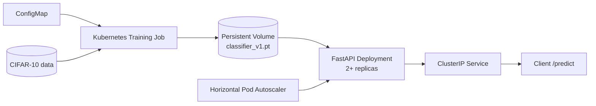

# MLOps PyTorch Pipeline

An end-to-end CIFAR-10 image-classification pipeline that trains a PyTorch model, packages training and inference as separate CPU-optimized Docker images, and runs them on Kubernetes with persistent storage, health probes, rolling updates, and autoscaling.

## Architecture



The training Job reads the YAML ConfigMap, downloads CIFAR-10, logs metrics as JSON lines, applies early stopping, and saves the best checkpoint. The serving Deployment mounts that checkpoint read-only and exposes `/health` and `/predict` through a ClusterIP Service.

## Repository layout

```text
src/           model, dataset, training, and FastAPI modules
configs/       local training configuration
docker/        separate multi-stage training and serving images
k8s/           namespace, ConfigMap, PVC, Job, Deployment, Service, and HPA
requirements/  pinned training, serving, and development dependencies
tests/         fast unit tests
docs/          reflection and evidence checklist
```

## Local Python setup

Python 3.11 is recommended.

```bash
python -m venv .venv
source .venv/bin/activate          # Windows PowerShell: .venv\Scripts\Activate.ps1
pip install -r requirements/train.txt -r requirements/serve.txt -r requirements/dev.txt
pytest -q
```

The default config uses container paths. For direct local training, use the included local override:

```bash
CONFIG_PATH=configs/training_config.local.yaml python -m src.train
```

Training emits structured events such as:

```json
{"epoch": 1, "event": "epoch_completed", "train_accuracy": 0.5123, "train_loss": 1.4321, "validation_accuracy": 0.6012, "validation_loss": 1.2011}
```

## Docker workflow

```bash
docker build -f docker/Dockerfile.train -t mlops-train:v1 .
docker run --rm \
  -v "$(pwd)/data:/app/data" \
  -v "$(pwd)/checkpoints:/app/checkpoints" \
  mlops-train:v1

docker build -f docker/Dockerfile.serve -t mlops-serve:v1 .
docker run --rm -p 8080:8080 \
  -v "$(pwd)/checkpoints:/app/checkpoints:ro" \
  mlops-serve:v1
```

Test the API with a PNG, JPEG, or WebP image:

```bash
curl http://localhost:8080/health
curl -X POST http://localhost:8080/predict -F "image=@test_image.png"
```

For a fast infrastructure-only Docker smoke test, mount `configs/smoke_config.yaml` over the container's default config. It uses TorchVision `FakeData`, the smaller CNN, and one epoch to validate logging, checkpoint persistence, and serving without claiming CIFAR-10 model quality. The production configuration continues to train on CIFAR-10.

## Kubernetes workflow

1. For Minikube, load the images with `minikube image load mlops-train:v1 mlops-serve:v1`. For a remote cluster, push both images to a registry and update the two image fields in the Job and Deployment.
2. Apply the training resources and wait for a checkpoint:

```bash
kubectl apply -f k8s/namespace.yaml
kubectl apply -f k8s/configmap.yaml
kubectl apply -f k8s/storage.yaml
kubectl apply -f k8s/training-job.yaml
kubectl logs -f job/model-training -n ml-training
kubectl wait --for=condition=complete job/model-training -n ml-training --timeout=30m
```

3. Deploy and inspect serving:

```bash
kubectl apply -f k8s/serving-deployment.yaml
kubectl apply -f k8s/serving-service.yaml
kubectl apply -f k8s/hpa.yaml
kubectl get pods -n ml-training
kubectl describe deployment model-serving -n ml-training
kubectl port-forward svc/model-serving 8080:80 -n ml-training
```

The optional `k8s/training-job-gpu-patch.yaml` demonstrates the bonus GPU request. A real GPU deployment must also use a CUDA-enabled training image rather than the default CPU-only image. Render the patch into a complete Job with the command in that file before applying it, and use it only on a cluster with NVIDIA device-plugin support and matching node labels.

For a constrained local cluster with less than the production Job's required 4 GiB allocatable memory, `k8s/smoke-configmap.yaml` and `k8s/training-job-smoke.yaml` provide a clearly labeled synthetic-data validation path. They do not replace the rubric-compliant production manifests or constitute a CIFAR-10 accuracy result.

## Configuration and secrets

Training configuration is injected by the `training-config` ConfigMap. The serving Deployment can optionally consume `model-serving-secrets`. Copy `k8s/secret.example.yaml` to the gitignored `k8s/secret.yaml`, replace its placeholder, and apply it only when a secret is actually required. Never commit real credentials.

## Git and submission workflow

Use `main` for releases and branch `develop` from it. Implement each unit of work on a feature branch, for example:

```bash
git switch develop
git switch -c feature/pytorch-training
# commit and open a PR into develop
git switch develop
git switch -c feature/docker-images
```

Create at least four meaningful PRs (two per week), then open the final PR from `develop` into `main`. Conventional Commit examples are `feat(training): add early stopping` and `infra(k8s): add serving probes`. Because AI assistance was used, disclose that fact in the relevant commit message as required by the assignment brief.

A practical four-PR split is:

1. Week 1 - `feature/model-and-dataset`: model, transforms, loaders, and model tests.
2. Week 1 - `feature/training-and-api`: configuration, training loop, checkpoint contract, and FastAPI service.
3. Week 2 - `feature/docker-and-ci`: pinned requirements, Dockerfiles, CI, and API tests.
4. Week 2 - `feature/kubernetes`: storage, Job, Deployment, Service, probes, HPA, documentation, and validation evidence.

Add an explicit trailer such as `AI-Assisted-By: OpenAI Codex` to commits containing AI-assisted work, and be prepared to explain and adapt every line.

Use [docs/validation-checklist.md](docs/validation-checklist.md) to gather genuine terminal evidence for the final PR. The required 300-500 word reflection is in [docs/reflection.md](docs/reflection.md).

Completed local Docker evidence is recorded in [docs/docker-validation.md](docs/docker-validation.md). It clearly separates the synthetic infrastructure smoke test from the production CIFAR-10 training run.

Completed local Kubernetes evidence is recorded in [docs/kubernetes-validation.md](docs/kubernetes-validation.md), including API-server manifest validation, the completed smoke Job, bound PVC, two-replica rollout, health/prediction requests, and live HPA metrics.
